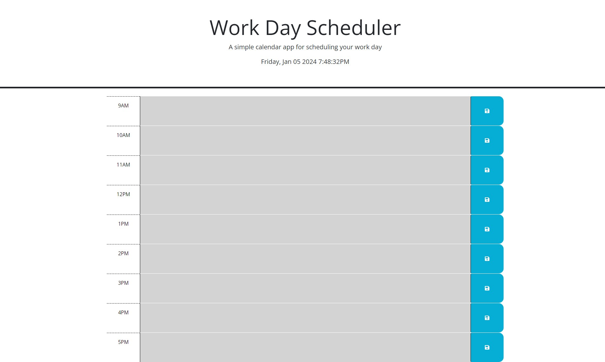

# Work Day Planenr
## Description

The goal of this project was to develop a work-centric event planner focusing on the average 9-5 work day. The planner displays the current day of the week, day, and time; each hour block is color coded so past hour blocks are grey, the current hour block is red, and future hour blocks are green.

## Installation

N/A

## Usage

The Work Day Planner is an easy to use application. The user simply needs to type in the whatever tasks or events they want to focus on in the text box next to a given hour block. Once they have input the desired info they need only hit the blue save button on the right of the page. The webpage will store their information for future visits until they manually erase it via the same method of hitting the save button while the text box is either empy or, has been updated with the current days events.

## Credits

Thank you to Leif and Sheetal for your instruction and explanations of concepts required to buil this application.

## License

Refer to the liscense in the GitHub repo.

## Links

Pop Quiz Website: [https://xwhoknowz.github.io/Work-Day-Planner/]

## Website Sample

.
